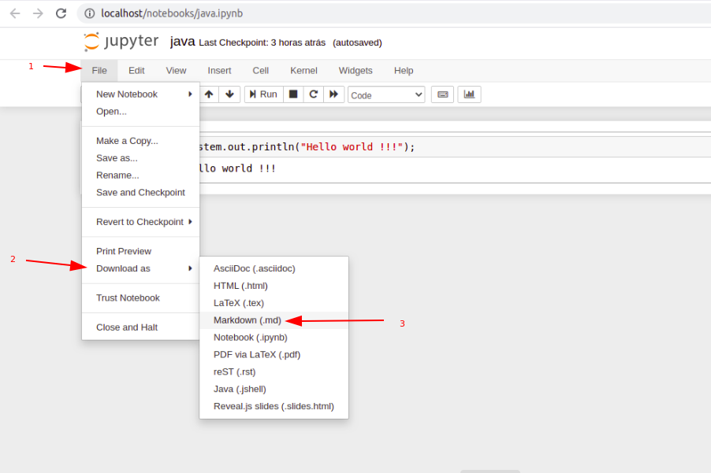

# Pré requisitos
- Ter o docker e docker-compose instalados na máquina. (se não tiver basta seguir este link https://docs.docker.com/compose/install/)

# Rodando com o Docker Compose
- Criar um arquivo .env na raiz do projeto (basta copiar ou renomear o arquivo .env.example). Nele, você pode escolher a porta que será mapeada para o jupyter-notebook e para o docsify (ferramenta usada para criar o site) que estarão rodando no docker
- Para rodar o projeto com o docker, basta executar o comando ```docker-compose up```
- Para acessar o notebook, basta acessar o localhost da sua máquina, na porta definida no .env (por padrão apenas ```localhost```)
- Para acessar o site, basta acessar o localhost da sua máquina, na porta definida no .env (por padrão ```localhost:8080```)

# Kernels suportados no jupyter notebook
- Java
- Javascript
- Python
- Ruby
- Coq
- Scala
- SoS (Script of Scripts)

Caso precise, solicite através de um issue a adição de outro kernel ou edite o Dockerfile e abra um pull request

# Gerando arquivos Markdown pelo jupyter notebook
Para criar novos arquivos, com o código compilado no notebook, basta fazer o download do arquivo com o formato .md

